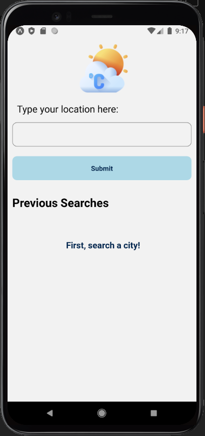
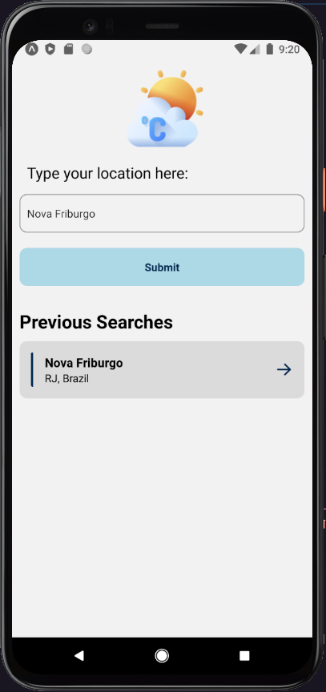
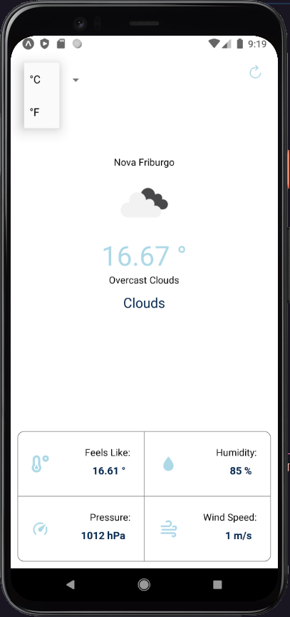

<h1 align="center" >
  
  Weather App
</h1>

<p align="center">
 <a href="#-sobre">Sobre</a> •
 <a href="#-layout">Layout</a> • 
 <a href="#-tecnologias">Tecnologias</a> •
</p>

---

## 💡 Sobre

Essa aplicação permite que você pesquise a temperatura de qualquer cidade e te informa algumas informações adicionais

---

## 🎨 Layout

<p align="center">
                              
  
                                
  
                               
  

</p>
<br>
---

## 👌 Funcionalidades

\*Procurar temperatura de uma cidade

## <br>

### Clonando o Repositório

```bash

$ git clone https://github.com/LelioH/weather-app.git

# entre na pasta do projeto


---

## 🛠️ Tecnologias

As ferramentas usadas no desenvolvimento do projeto.

- JavaScript
- React Native
- Expo
- Axios

---
```
